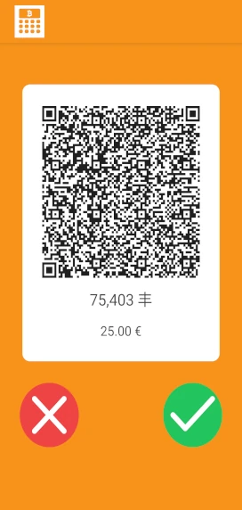

# SatoshisPay

<p align="center">
  
</p>

<p align="center">~ An app for shops to easily accept payments with Bitcoin on the Lightning network ~</p>

[](https://github.com/SatoshisPay/satoshispay/actions/workflows/ci.yml)
[](https://conventionalcommits.org)

## Description

SatoshisPay is an Android/iOS application meant to be used by Italian retailers to accept Bitcoin payments on the Lightning Network.

The app supports the following features:

- Deposit from BTC address to your Lightning Network wallet
- Insert a FIAT (EUR) import and generate a LN invoice to accept the payment
- View the transactions history
- Withdraw the LN balance on your BTC address

## Developers

To contribute as a developer, here you can find how to get started with the project.

### Requirements

In order to develop on SatoshisPay, you are required for the following software on your machine

- [yarn](https://classic.yarnpkg.com/lang/en/docs/install/#debian-stable). I suggest you using [nvm](https://github.com/nvm-sh/nvm) on your machine for a better NodeJS version management.
- [Android Studio](https://reactnative.dev/docs/environment-setup?guide=native&os=linux&package-manager=yarn&platform=android)

### Setup

1. Install dependencies

    ```sh
    yarn
    ```

2. Start development server

    ```sh
    yarn start
    ```

3. Launch emulator

    Now if you press `a` you should be able to run it on the Android emulator.

## Contributing

Contributions to improve the app with new features and ideas, or just bugfix are welcome!

Please read our [CONTRIBUTING](./CONTRIBUTING.md) guidelines first.

## Support Us

If you wish to support our project, please consider a donation

[](https://btc.com/bc1qql247l894ahqvd5affjk69mrf49dcnxg7c0l74)


`bc1qql247l894ahqvd5affjk69mrf49dcnxg7c0l74`

## The Lightning Node

Currently SatoshisPay is connected to the Lightning Network thanks to the node powered by [Breez](https://breez.technology/).

## Powered By

Satoshispay relies on [Breez](https://breez.technology/) to allow Lightning Network payments.


SatoshisPay is powered by these awesome projects:

- [BitcoinJs](https://github.com/bitcoinjs/bitcoinjs-lib)
- [Nativewind](https://github.com/marklawlor/nativewind)
- [React-native-keychain](https://github.com/oblador/react-native-keychain)
- [React-qr-code](https://github.com/rosskhanas/react-qr-code)
- [React-native-vision-camera](https://github.com/mrousavy/react-native-vision-camera)

## Gallery





## License

Licensed under [Apache License, Version 2.0](/LICENSE).
